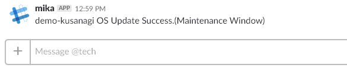

# magatama_mwとは
指定時刻にyumリポジトリのアップデートを検出し、自動的にOSをアップデートしてリブートし、通知を行うスクリプト群です。

## 使い方
- `magatama_mw.sh`を`/root`もしくは`/tmp`にダウンロード
- `sh magatama_mw.sh setup | sh`を実行
- `/root/bin/magatama_mw.sh`でヘルプを表示
- `/root/bin/magatama_mw.sh init`で、crontabにスクリプトを登録
- `crontab -e`で、メンテナンスウィンドウ（実行時刻）を調整
- `/root/bin/magatama_mw.sh maintenance force`で強制的にアップデートを実行。

## サブコマンド
- `setup` - 初回インストールを実行するスクリプトを表示します。`/bin/sh`にパイプで渡して実行します。
- `init` - cronにスクリプトを登録します。
- `maintenance` - yumリポジトリをチェックし、アップデートがあった場合はアップデート及びリブートを実行します。
- `maintenance force` - yumリポジトリの状態に関わらず、強制的にアップデート処理を行います。
- `reboot` - OS起動直後にcronから実行します。ステータスファイルを確認し、通知およびクリーンアップを行います。
- (none) - ヘルプを表示します。

## 関連ファイル
 - `magatama_notify.sample.sh` - Slack通知のサンプルファイルです。`magatama_notify.sh`にリネームしてください。
 - `magatama_mw_pre.sh` - アップデート前に事前実行されるスクリプトです。戻り値が`0`でない場合、アップデートは中断されます。
 - `magatama_mw_post.sh` - アップデート後、リブート後に実行されるスクリプトです。戻り値が`0`でない場合、以降の処理は中断されます。 

## Slack通知
`/root/bin/magatama_slack.sh`に、Slackの通知先を指定する事により、メンテナンス完了後に通知を行います。  
`magatama_slack.sample.sh`をコピーして修正してください。  

## Version history
- 1.00 - 2018.04.18 Akira Tsumura
