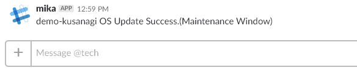

# magatama auto update
KUSANAGI's auto update and reboot utility.

## How to use
- download 'magatama_mw.sh' to KUSANAGI's /root.
- run `sh magatama_mw.sh setup | sh`.
- run `/root/bin/magatama_mw.sh`, show help.
- run `/root/bin/magatama_mw.sh init`, setup crontab.
- edit maintenance-window, `crontab -e`.
- force run update `/root/bin/magatama_mw.sh maintenance force`, run yum update and reboot KUSANAGI(CentOS).

## Options
- setup - show first setup script, pipe to /bin/sh.
- init - init crontab.
- maintenance - check yum repositorys, update, and reboot from crontab. 
- force maintenance - `magatama_mw.sh maintenance force`
- reboot - check rebooted and notify slack(optional).
- (none) - show help.

## How to Slack Notyfy
make `/root/bin/magatama_slack.sh`.  
require from maintenance-scripts, no +w parmission.  

## Version history
- 1.00 - 2018.04.18 Akira Tsumura
